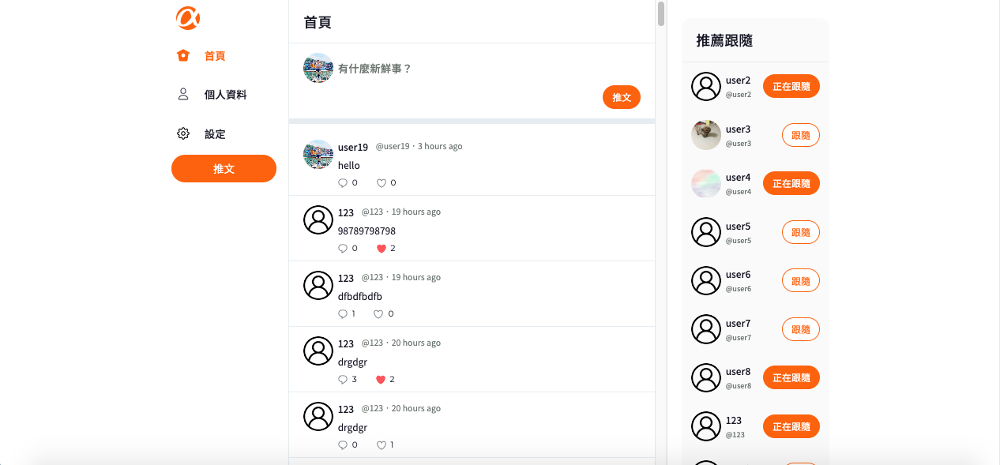
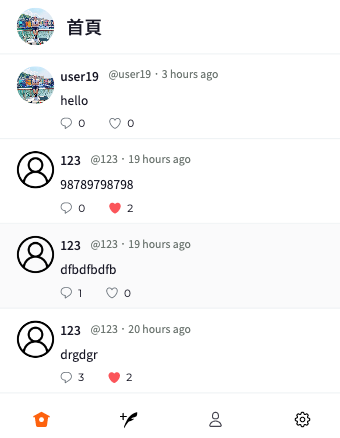

# simple-twitter
*電腦版

＊手機版


## 專案介紹

### 在前台，你可以——
1. 註冊一個帳號帳號來使用這個網站，帳號與Email皆不可與其他使用者重複
2. 使用使用者身份登入帳號，如果帳號密碼有誤或是漏填，均可得到清楚的提示 
3. 登入後可以：

<ul>
(1)首頁
<li>在側邊攔切換頁籤</li>
<li>在首頁可以點擊輸入框發送推文</li>
<li>查看網站所有的推文，排列順序由新到舊</li>
<li>查看某特定一篇的推文，其回覆排列順序由新到舊</li>
</ul>

<ul>
(2)使用者頁面
<li>查看單一使用者喜推文，排列順序由新到舊</li>
<li>查看單一使用者回覆，排列順序由新到舊</li>
<li>查看單一使用者喜歡的內容，排列順序由新到舊</li>
<li>查看自己與其他使用者的個人頁面</li>
<li>更改自己的帳號資訊、封面照片、個人照片</li>
<li>刪除自己封面照片</li>
</ul>

<ul>
(3)設定頁面
<li>更改自己的註冊的帳號資訊</li>
</ul>

<ul>
(4)共同功能
<li>點擊與回覆其他使用者的貼文</li>
<li>喜歡或取消喜歡其他使用者的貼文</li>
<li>追蹤或退追蹤使用者</li>
<li>查看目前網站中追蹤數排名前十名的使用者</li>
<li>在側邊攔登出，回到登入頁面</li>
</ul>


### 在後台，你可以——

1. 使用管理員身分登入帳號，如果帳號密碼有誤或是漏填，均可得到清楚的提示
2. 登入後可以在側邊攔切換頁籤
3. 在推文清單頁面瀏覽所有推文
4. 在推文清單頁面刪除任一筆推文，並會跳出確認視窗
5. 在使用者列表瀏覽所有註冊帳號的使用者，依照推文數量排序
6. 在側邊攔登出，回到登入頁面

## 安裝專案

### 前置作業：下載 npm / vue-cli

```
npm install
```

```
npm install -g @vue/cli@4.1.1
```

### 在 terminal 輸入以下文字，複製專案至本機資料夾中

```
git clone https://github.com/raven0613/simple_twitter.git
```

※以下步驟請確認 terminal 的目前資料夾位置是在 simple_twitter※

### 啟動專案

```
npm run serve
```

### 在任一瀏覽器網址列輸入以下網址，開始體驗！

```
http://localhost:8080/
```

關閉專案請在 terminal 輸入 ctrl / command + C

## 使用專案

前台測試帳號：

```
帳號：user1
```

```
密碼：12345678
```

後台測試帳號：

```
帳號：root
```

```
密碼：12345678
```

## 開發工具

<ul dir="auto">
<li>vue 2.6.11</li>
<li>vue-router 3.5.1</li>
<li>vuex 3.6.2</li>
<li>axios 0.19.2</li>
<li>sweetalert2 9.8.2</li>
<li>moment 2.24.0</li>
<li>eslint 6.7.2</li>
詳細可參考 package.json
</ul>
